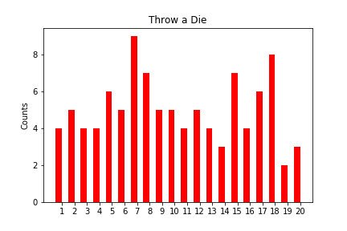

# Rolling The Dice


## Table of Contents
* [Objective](#Objective)
* [Technologies](#Technologies)
* [Process](#Process)
* [Deployment](#Deployment)
* [Visualization](#Visualization)

# Objective 
Develop a program that anticipates the average of 100 rolls of a 20-sided fair die.

# Technologies
* Python
* Matplotlib

# Process
* Define Die Throw function.

```
def throw_die(data_list, times):
    total = 0
    for i in range(times):
        num = random.randint(1,20)
        total = total + num
        data_list[num-1] = data_list[num-1] + 1
    average = total * 1.0 / times
    return average;
```

* Create a place for the data to be stored.

```
    test_data = [0, 0, 0, 0, 0, 0, 0, 0, 0, 0, 0, 0, 0, 0, 0, 0, 0, 0, 0, 0]
times = 1 
average = throw_die(test_data,times)
print (f"The average is ",average)
```

* Create Standard Deviation function.

```
    def sd_calc(test_data):
    n = len(test_data)

    if n <= 1:
        return 0.0

    mean, sd = avg_calc(test_data), 0.0

    # calculate stan. dev.
    for el in test_data:
        sd += (float(el) - mean)**2
    sd = math.sqrt(sd / float(n-1))

    return sd
```
    
* Create Average Calculation function.

```
    def avg_calc(ls):
    n, mean = len(ls), 0.0

    if n <= 1:
        return ls[0]

    # calculate average
    for el in ls:
        mean = mean + float(el)
    mean = mean / float(n)

    return mean
```
    
* Print Sample Data.

```
data = [4, 2, 5, 8, 6]
print("Sample Data: ",test_data)
print("Standard Deviation : ",sd_calc(test_data))
```

* Create a bar chart that displays die throwing data.

```
ind = np.arange(20)  
width = 0.5  
fig, ax = plt.subplots()
result = ax.bar(ind+width/2, test_data, width,color='r')
ax.set_ylabel('Counts')
ax.set_title('Throw a Die')
ax.set_xticks(ind+width)
ax.set_xticklabels( ('1', '2', '3', '4', '5','6', '7', '8', '9', '10', '11', '12', '13', '14', '15','16', '17', '18', '19', '20') )
plt.show()
```

# Visualization





